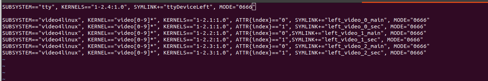
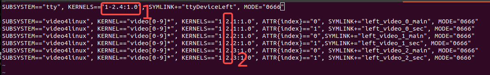
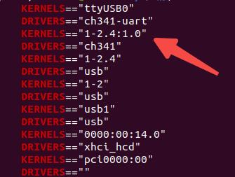
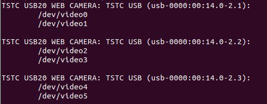
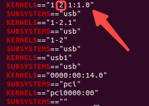
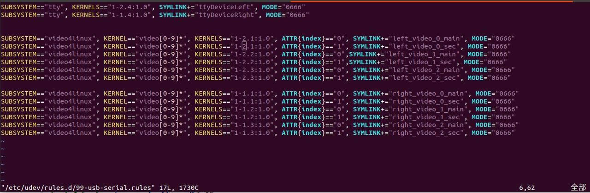
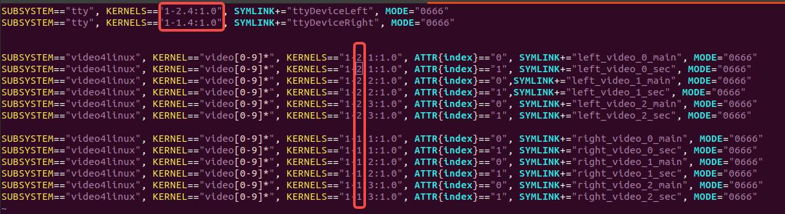

# genrobot_controller_sdk
## 环境部署
```
PC机系统要求：ubuntu20.04
通信：ros1系统
环境按requirements.txt配置
USB接口需3.0
```

## 进入目录
```
cd genrobot_controller_sdk
```

## 配置USB接口

### 单爪USB口配置
最终配置形式如图,配置完后该USB口可以识别任意Gen Controller，后续无需再次配置，该文件模板存放在
```
config/99-usb-serial.rules
```
  

用户需修改地方为:  
  

参数1处修改方法如下，
执行：

```
cd /dev && ls | grep ttyUSB
udevadm info -a -n /dev/ttyUSB* | grep -E "KERNELS|DRIVERS"
```

将输出中的第二个KERNELS数值配置到1处:  


参数2处修改方法如下，执行：
```
v4l2-ctl --list-devices
```
输出  


然后针对该USB的第一个相机执行：
```
udevadm info -a -n /dev/video* | grep -E "KERNELS|SUBSYSTEMS"
```
将输出的第一个KERNELS数值配置为到2处  
  
然后将模板文件copy至下列地址处
```
sudo cp config/99-usb-serial.rules /etc/udev/rules.d/
```
然后加载配置
```
sudo udevadm control --reload-rules
sudo udevadm trigger
```

### 双爪USB口配置
最终配置形式如图所示  


需修改地方  


首先插入左夹爪，按照单夹爪的配置方法进行配置；然后拔下左夹爪，插入右夹爪，再次按照单夹爪的配置方法进行配置；最后加载配置。

### 多爪USB口配置
再次同样添加配置到99-usb-serial.rules中。

## SDK安装
执行以下指令
```
cd genrobot_controller_sdk
sudo install/install.sh
```

## 单爪启动
```
cd genrobot_controller_sdk
source install/setup.bash
roslaunch robot_driver single_gripper_start.launch
```

启动后会弹出三个图像窗口，输出topic有：
```
/camera/color/image_raw     # 中间相机
/camera_1/color/image_raw   # 左侧相机
/camera_2/color/image_raw   # 右侧相机
/encoder                    # 夹爪实际开合距离反馈
/tactile/left               # 夹爪左侧触觉
/tactile/right              # 夹爪右侧触觉
/target_distance            # 夹爪开合距离指令
```


### 启动demo脚本接收指令控制夹爪开合
```
# /target_distance 输入距离区间为[0.0, 0.103],即最大可开10cm
python3 script/das_controller_infer.py
```


## 双爪启动
```
cd genrobot_controller_sdk
source install/setup.bash
roslaunch robot_driver dual_gripper_start.launch
```

启动后会弹出六个图像窗口，输出topic有：
```
/left_gripper/camera/color/image_raw    # 左夹爪中间相机
/left_gripper/camera_1/color/image_raw  # 左夹爪左侧相机
/left_gripper/camera_2/color/image_raw  # 左夹爪右侧相机
/left_gripper/encoder                   # 左夹爪实际开合距离反馈
/left_gripper/tactile/left              # 左夹爪左侧触觉
/left_gripper/tactile/right             # 左夹爪右侧触觉
/left_gripper/target_distance           # 左夹爪开合距离指令

/right_gripper/camera/color/image_raw   # 右夹爪中间相机
/right_gripper/camera_1/color/image_raw # 右夹爪左侧相机
/right_gripper/camera_2/color/image_raw # 右夹爪右侧相机
/right_gripper/encoder                  # 右夹爪实际开合距离反馈
/right_gripper/tactile/left             # 右夹爪左侧触觉
/right_gripper/tactile/right            # 右夹爪右侧触觉
/right_gripper/target_distance          # 右夹爪开合距离指令
```

### 启动demo脚本接收指令控制夹爪开合，左夹爪和右夹爪控制指令：
```
# /left_gripper/target_distance和/right_gripper/target_distance输入距离区间为[0.0, 0.103],即最大可开10cm
python3 script/left_das_controller_infer.py
python3 script/right_das_controller_infer.py
```
